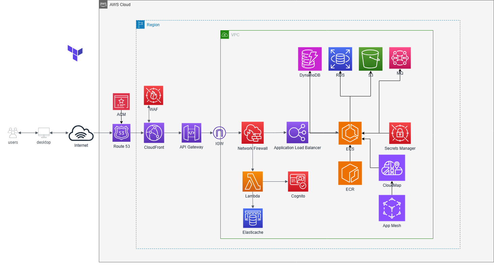

# Deployment
This repository manages the infrastructure for our cloud-based services using Terraform and Terragrunt. It's structured to provision a variety of AWS resources and handle multiple environments with automatic workspace switching.


## Infrastructure Components

The AWS resources provisioned by this repository include:

- **CloudFront**: Content Delivery Network (CDN) for distributing content with low latency.
- **Elastic Container Registry (ECR)**: Docker container registry for storing, managing, and deploying container images.
- **Elastic Container Service (ECS)**: Container orchestration service for running and scaling applications.
- **Application Load Balancer (ALB)**: Automatically distributes incoming application traffic across multiple targets.
- **Route 53**: DNS web service for reliable and cost-effective domain name lookup.
- **CloudWatch**: Monitoring and observability service for resource and application monitoring.
- **IAM Roles**: Securely control access to AWS services and resources.
- **MQ**: Managed message broker service for Apache ActiveMQ and RabbitMQ.
- **Web Application Firewall (WAF)**: Protects web applications from common web exploits.
- **Lambda**: Event-driven, serverless computing platform.
- **API Gateway**: Service for creating, publishing, maintaining, monitoring, and securing APIs.
- **S3**: Object storage service with industry-leading scalability, data availability, security, and performance.

## Environments

- **Staging**: An isolated environment that closely resembles production. Used for testing.
- **Production**: The live environment where the application runs.

## Features

- **Workspace Switching**: With Terragrunt, we automate the switching of workspaces to manage multiple environments, ensuring that the correct configuration is applied to the corresponding stage.

## Prerequisites

Before you begin, ensure you have the following installed:
- Terraform
- Terragrunt

## Usage

To initialize the Terraform configuration, run:

```sh
terraform init
```

To switch between workspaces for different environments, Terragrunt handles this automatically based on the configurations.

To apply the infrastructure changes, navigate to the environment-specific directory and run:

```sh
terragrunt apply
```
